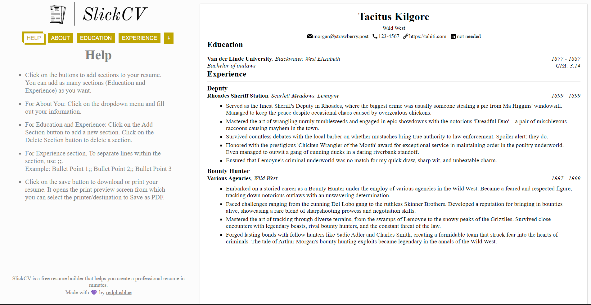

# SlickCV

### SlickCV is a free resume builder that helps you create a professional resume in minutes.

<table>
  <td align="center"><b>Made using:</b></td>
  <td> 
    
    
    
    
    
    
  </td>
</table>

###### Additional libraries used: eslint [for react], prop-types, uuid [For key generation]

## **Click on the pictures/the link below to try!**

## [Click to open](https://redplusblue.github.io/SlickCV/)

## Features:

1. Does all the basic stuff (Add about you, education, experience info.).
2. Live reload: Whatever changes you make to any part of the resume are shown in real time on the right side.
3. No limit to number of sections or number of pages.
4. Can add bullet points in Experience section.
5. Can save the resume as PDF or print it directly.

I think it looks kinda neat too :D

## What I used/learned:

1. React: States, Hooks, hot reloading, react-dom, components, props, nested components, shared states, 
2. Using JS with React to store constants, and run scripts to interact with the DOM.

### What I did well (I think):

1. Code is clean and modularized.  
2. Webpage is aligned and styled proportionately, with minimalism in mind. Most of the elements are symmetrical. Sudden changes in layout are reduced to a minimum and animations are used to smoothen the transition.
3. User experience is smooth and intuitive, especially because of the real time changes.

### What I could've done better (Working on it...):

1. The AI could be more intelligent, and could be more efficient.
2. The game could have more graphical elements.
3. The game could have a player vs player mode.
4. Some of the commits were lost because not pushing to remote repository often enough, which resulted in a lot of changes being less organized than they could have been.

 

###### An exercise for [TheOdinProject](theodinproject.com)

